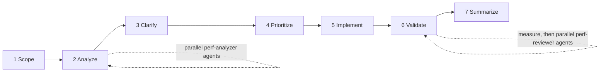

# tempo

Performance optimization workflow for Claude Code - estimate first, measure always.

Packages Jeff Dean and Sanjay Ghemawat's [Performance Hints](https://abseil.io/fast/hints.html) as a working discipline: a `/perf` command that runs a gated 7-phase workflow, read-only analyzer and reviewer agents, and a skill with distilled reference material that teaches offline. Principles stay language-agnostic; concrete patterns target Python/Django and TypeScript/Vue.

## Install

```
/plugin marketplace add https://github.com/tslateman/tempo
/plugin install tempo@tempo
```

For local development, point the marketplace at the working copy:

```
/plugin marketplace add ~/dev/tempo
/plugin install tempo@tempo
```

## Usage

```
/perf src/orders/
```

The workflow:



Two hard gates: clarifying questions before prioritization, and explicit approval before implementation. Validation measures first - existing benchmarks, query counts, or a minimal timing harness - and falls back to static review only when execution is impossible. An unmeasured change is never reported as validated.

## Components

| Component                  | Role                                                                        |
| -------------------------- | --------------------------------------------------------------------------- |
| `commands/perf.md`         | The 7-phase workflow                                                        |
| `agents/perf-analyzer.md`  | Read-only analysis: back-of-envelope estimates, stack-specific pattern scan |
| `agents/perf-reviewer.md`  | Read-only validation: correctness first, then the performance claim         |
| `skills/performance-hints` | Auto-triggering skill with routing to six distilled reference files         |

The reference files (estimating, measuring, memory, debugging, API design, reviewing) are self-contained - each teaches its topic with zero network access, with abseil.io sources as footnotes.

## What the analyzer looks for

It estimates first, using the Abseil latency table, so patterns that cannot matter get ranked LOW rather than reported as findings.

- **Django ORM.** N+1 on forward and reverse relations, querysets evaluated in loops, missing `bulk_create` / `bulk_update` / `in_bulk`, over-fetched columns, unbounded fetches, missing indexes, prefetch discarded by a later `.filter()`.
- **Concurrency and I/O.** Sequential independent awaits, client constructed per call, blocking calls inside `async def`, `async_to_sync` on a hot path, unbatched external APIs.
- **CPU and allocation.** Hot-loop allocation, quadratic string building, membership tests against lists, repeated pure computation, regex where a prefix match works, per-item serialization, logging cost when disabled.
- **Vue and browser.** Deep watchers over large state, work inside `computed`, method calls in templates, `v-for` without stable keys, unvirtualized long lists, fetch waterfalls, oversized bundles.

## Design notes

- **No invented benchmark numbers.** Hardware costs come from the Abseil table and are cited. Application-level figures are labeled as order-of-magnitude priors for ranking candidates, to be replaced by measurement.
- **Narrow trigger.** The skill fires on performance work. "Write tests for this" and "review this PR" do not trigger it absent a performance angle.
- **Counts over timings.** Query counts, allocation counts, and payload sizes are deterministic. Wall-clock time on a laptop is noise with a trend in it.
- **Performance only.** No general testing, code review, or team process content.

## Related

[`duet`](https://github.com/tslateman/duet) ships a `performance` skill covering the profiling loop and trade-off framework at a general level. tempo is narrower and deeper: estimate-first discipline, the gated workflow with agents, and stack-specific pattern detection.

## Credits

- Jeff Dean and Sanjay Ghemawat, [Performance Hints](https://abseil.io/fast/hints.html), and the Abseil [Fast Tips](https://abseil.io/fast/) series - the intellectual source
- [areu01or00/perf-hints](https://github.com/areu01or00/perf-hints) (MIT) - prior art; this plugin keeps its workflow structure and agent split, and replaces its link-list references with distilled content

## License

MIT
