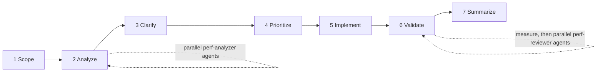

# tempo

Performance optimization workflow for Claude Code - estimate first, measure always.

Packages Jeff Dean and Sanjay Ghemawat's [Performance Hints](https://abseil.io/fast/hints.html) as a working discipline: a `/perf` command that runs a gated 7-phase workflow, read-only analyzer and reviewer agents, and a skill with distilled reference material that teaches offline. Principles stay language-agnostic; concrete patterns target Python/Django and TypeScript/Vue.

## Install

```
/plugin marketplace add https://github.com/tslateman/tempo
/plugin install tempo@tempo
```

## Usage

```
/perf src/orders/
```

The workflow:



Two hard gates: clarifying questions before prioritization, and explicit approval before implementation. Validation measures first - existing benchmarks, a minimal timing harness, or query counts - and falls back to static review only when execution is impossible.

## Components

| Component                  | Role                                                                        |
| -------------------------- | --------------------------------------------------------------------------- |
| `commands/perf.md`         | The 7-phase workflow                                                        |
| `agents/perf-analyzer.md`  | Read-only analysis: back-of-envelope estimates, stack-specific pattern scan |
| `agents/perf-reviewer.md`  | Read-only validation: correctness first, then the performance claim         |
| `skills/performance-hints` | Auto-triggering skill with routing to six distilled reference files         |

The reference files (estimating, measuring, memory, debugging, API design, reviewing) are self-contained - each teaches its topic with zero network access, with abseil.io sources as footnotes.

## Credits

- Jeff Dean and Sanjay Ghemawat, [Performance Hints](https://abseil.io/fast/hints.html), and the Abseil [Fast Tips](https://abseil.io/fast/) series - the intellectual source
- [areu01or00/perf-hints](https://github.com/areu01or00/perf-hints) (MIT) - prior art; this plugin keeps its workflow structure and agent split, and replaces its link-list references with distilled content

## License

MIT
